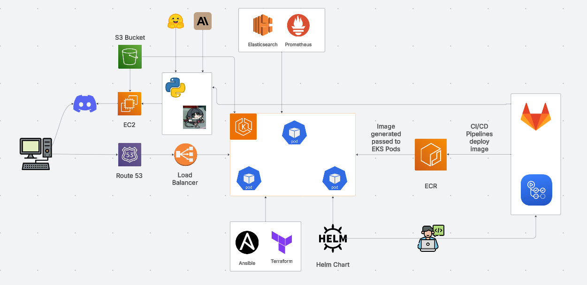

## Table of Contents

1 [Introduction](#1-introduction)
- 1.1 [Overview](#11-overview)
- 1.2 [Purpose](#12-purpose)
- 1.3 [Scope](#13-scopre)
- 1.4 [Possible Competitors](#14-possible-competitors)

2 [General Description](#2-general-description)
- 2.1 [System Architecture](#21-system-architecture)
- 2.2 [Main Functions](#22-main-functions)
    - 2.2.1 [Getting started](#221-getting-started)
- 2.3 [Target Demographic](#23-target-demographic)

# 1 Introduction

## 1.1 Overview
JaneBot is a product that revolves around monitoring a user's screen time on their computers. The bot will detect the activities of users through the official Discord API, analyse the data, and perform different processes based off the data collected to be displayed through a web application.

JaneBot aims to inform its users the metrics in relation to their time on their computer, show how long they've spent on it and provide insights and recommendations from the data.

## 1.2 Purpose

The purpose of JaneBot is to provide a simple method for users to track their screen time and other metrics. It relieves the idea of having to download an entirely different application by simplifying it down to just one single Discord bot.

## 1.3 Scope

Scope of JaneBot

1. Track how long a user spends on their computer
> It is a safe assumption that the newer generation of young adults who spend time on their computers will always have Discord open in the background. This is more evident for programmers and gamers. We can use Discord as a medium to allow us to track how long a user might be spending on their computer by tracking the difference in time from when they first appear online until they appear offline.

2. Analyse the data and provide recommendations for users
> We want to be able to recommend users to new games based off the data collected from the bot. For example, if a user is spotted playing Valorant, JaneBot will utilise a machine learning model to recommend the user similar games, which in this case could be CSGO.

> Additionally, we should also provide challenges for users who aim to get better at certain games. For instance, after the signup, we will ask users to provide some games that they would like to play, see which games they would like otto improve in, then provide challenges for them that might help them improve. By setting goals like these, we hope to help our users also get better at the games they play.
    
2. Warn users that may be spending too much time on their computers
> During signup, we can prompt users to provide a certain time frame that they would like to be online for before being notified for exceeding their own screen limit. This may seem counterproductive based off the details from the last point, but our target audience is not only for people who are looking to improve in games, but also for people who just play games casually.

4. Provide a simple method to be able to inform users of the details they would like
> We aim to deploy a full stack application online for all people to be able to access (after logging in). This makes it easier for people to see their data whenever they want
    

## 1.4 Possible competitors

It is already very evident that we will be competing against a multitude of different desktop applications that track screen time. 

> The edge that JaneBot has is that it provides a universal method to be able to track screen time, without having to install the same application again. For example, if you have 2 devices (maybe a laptop and a desktop PC), you will have to download your screen time tracker application on both, as opposed to just having Discord. This in turn, will also end up consuming more memory on your computer for having another background process. With JaneBot, as long as you are using Discord, we will be able to provide that service to you.

A list of competitors include
- ActivityWatch
- Clockify
- It's FOSS
- Steam (includes a game time tracker in the app! But, it is worth mentioning that Steam **only** tracks time on games that are from Steam, and does not track time for games outside of Steam)

## 2. General Description

## 2.1 System Architecture

### 2.2 Main Functions

The main functions of our product include

- A Python Discord bot that tracks the screen time of a person who have their status' set to online 
- A full stack application deployed on Cloud that displays the metrics of our users to them in a simple, and accessible fashion
- Using a machine learning model to analyse the metrics and to provide recommendations and warnings, such as exceeding expected daily screen time to users
- Provide a method for users who are worried about their screen time on their computers. We can offer services such as notifying a user of exceeding the specified screen time when subscribed to a feature. We can send a message directly to them! No need to have an email application hovering in the background.

### 2.2.1 Getting started

To begin the registration, which is an event triggered when the user sends a command to the bot (like `j!register` for instance), the bot will immediately send a series of questions (or a google form) asking the user a range of different questions. Such questions may include
- If they play video games (if true, ask what games they play and the preferred genre)
- Ask what their goal is (to decrease screen time, simply track times on games etc)
- Ask what future features they would like to see implemented. This can immediately provide us inputs on how we may improve the quality of our bot. 

The purpose of this registration is to feed our bot some information before continuing. With this information, we can start recommending new games to our users, or challenges for them to undertake for their games. If the user doesn't play games often and just bought their computer, that's okay, our bot can work something out with the information retrieved from this questionnaire.

Please note, the questions to be asked have not been finalised. But we would like to ask questions that give us an idea about our user so that the machine learning model will have something to work with.

### 2.3 Target Demographic

The target demographic for JaneBot are for people who would often use Discord as a method to communicate with friends. JaneBot is not limited to a specific age range, but in order to comply with GDPR rules, we will restrict services to **only** adults, and thus, will not offer our services to people who register with an age that is less than 18.

---

### Maintainers

**Developer 1:** RJ Paraiso

**Developer 2:** Hind Mohamed  
